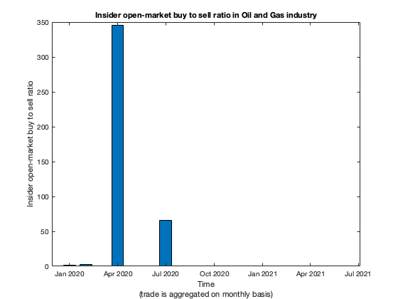
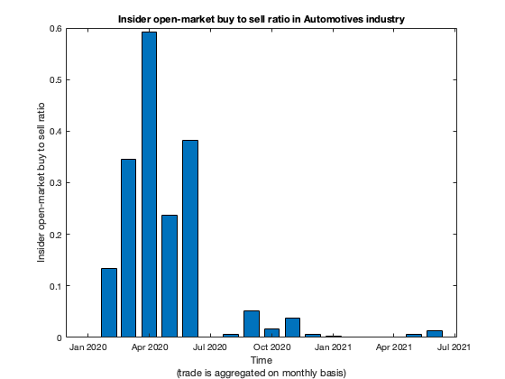
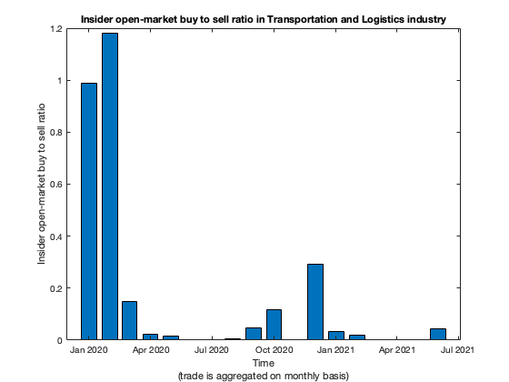
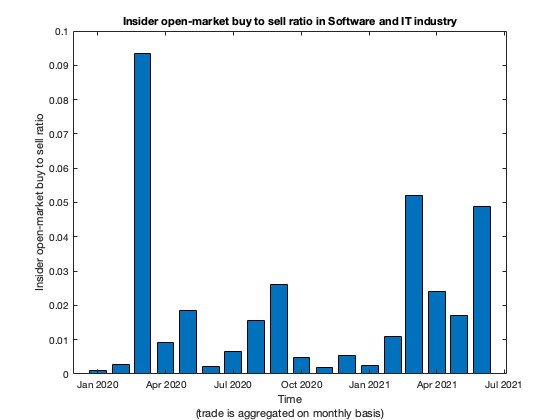
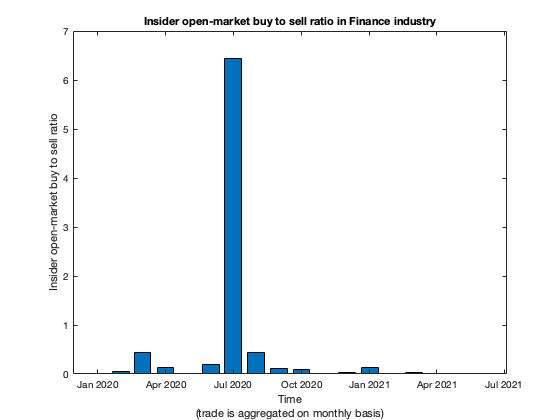
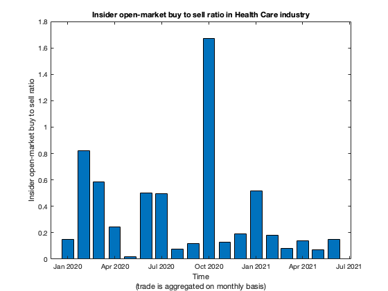
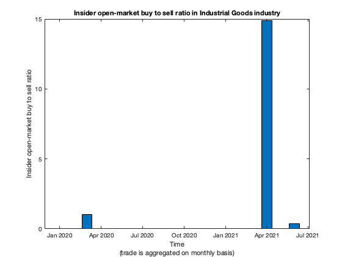
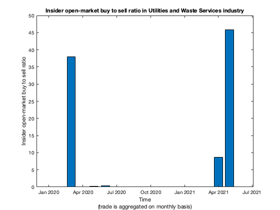

Abstract
========
I use COVID-induced market crash and subsequent recovery as natural experiment to examine insider
trade behaviour.  Using insider open-market buy-to-sell ratio from 2020 January to 2021 June
grouped by 19 industries and aggregated on monthly basis, I find evidence suggesting insiders
are conscious of market conditions, and their trading patterns may be useful for the public
when making investment decisions.

See [detailed report](report/report.pdf) for my research
(This is a link to the pdf report in my repository.  You can download the raw pdf file and view it).

Introduction
========
I became interested in financial investment since COVID induced lock down, and realized that if I am
to achieve any form of financial independence, I must understand money, and financial investment
such that the money I saved in the past can generate more money in the future.

This repository contains report on my investigation.

Background
========
There are fewer jobs offering pension (defined-benefit) schemes now and the majority of people use 401K or
similar defined-contributions scheme to financially prepare for retirement.  As a result, people have
taken on the responsiblity of managing and investing their own money regardless
whether they are able to handle the responsibility.

There are various investment approaches including stocks, bonds,
private equity and real estates.
However, since COVID-induced market crash in 2020 March, the financial market and housing market have significantly risen.
Unless people have correctly timed the market, the current market appears to be highly valued and do not
appear to offer appealing investment opportunities.

W. Buffet has suggested people who are not financially
savvy should invest in S&P500 index fund because the index fund has low managerial overhead cost,
offers diversification and benefits from growing US economy
(See W. Buffet annual report and annual shareholder meeting for his opinion on investing and S&P500 index).
One drawback for S&P500 index is the method is similar to momentum trading.  When Tesla and Moderna were added
to the index, the index bought these companys' stock at high valuation.  In general, when a company's stock
price rises and its market capitalization increases, the index mandates buying the company's stock to match
the increased market capitalization.  Similarly, when stock falls for a company, the index sell the stock.
While the index method has produced positive past result, it does not guarantee future positive return
especially in environment in which easy money is harder to come (rising interest rate and reduced quantatitive easing
to contain inflation).  The indexing method also does not exploit value investing or contrarian investing mind set
in which stocks are bought cheaply and sold dearly.  In fact its momentum trading similarities make it appear
to be the oppositie of value investing.

J.C. Bogle also suggested stock and bond split each investing in broad market index as long-term investment strategy
(WSJ. 4 Steps to Common-Sense Investing.  2019-05-09. Page S004).  While I think the strategy is sound in normal
times, it may not be appropriate now because interest rates in US is extremely low.  As interest rates will likely
rise in future, the bond price and the bond index must lose value.  Given the extra-ordinary money printing by
the Federal Reserve, there is easy money everywhere resulting in measured inflation, allevated stock price
and high housing price.  Given this circumstance, broad US stock index is unlikely to have good future returns
when cheap money disappears as the Federal Reserve reduce quantatitive easing and raise interest rate.

E. Chanceller argues investment should be made from capital cycle point of view
(E. Chancellor. 2016. Capital Returns: Investing Through the Capital Cycle A Money Manager's Reports, 2002 - 15).
Future outsized return is more likely when investment is made when capital is flowing out of an industry,
and return is likely less when investment in environment in which capital is flowing into an industry.
Applying this idea would suggest investing in oil and gas industry during its downturn in 2020, and avoiding
green energy investment because of currently large capital inflow into the industry.
Because of the quick rebound in oil and gas price, even investment opportunity in oil and gas industry is reduced.

This leaves the question of what to do for everyone who is forced to manage her money.  Should she hire professional
to manage, who may not be able to beat S&P500, be taking risks beyond the comfort level of the client and charge
significant fees.  Or stick with indexing strategy with money split between bond and stock, with risk that monetary
tightening having adverse effects on portfolio.  Or stick with cash or low interest saving account and hope that
the financial market crashes, offering buy-in opportunities.  But no one knows when or if market will crash
and rising inflation is constantly reducing cash's effective value.
This is serious issue because retirement is dependent more on
financial independence than age.  Social security benefits
may be insufficient to cover people's financial needs,
so sound investment strategy is key to ensure financial independence.

My invest approach is centered around while general investment
opportunities may be scarce, insider trading activity
may provide insights into investment opportunities.  When insider
trading pattern is combined with other value investing approaches,
the combined method may help the public decide when and at what
price to buy or sell stocks.

Insider Trading Research
========
Academic insider trading research has generally found clustered insider open-market buy is correlated with outsized
stock performance.  COVID induced market downturn and subsequent recovery offer natural experiment for insider
behaviour, so I collected insider trading data and calculated insider open-market buy-to-sell ratio
from 2020 January to 2021 June grouped by industrial sectors and aggregated on monthly basis.
The goal of the analysis is to see whether insider buy-to-sell ratio can be useful indicator for investment.
I broke data into 19 industries and found the buy-to-sell patterns for various industries can be broken into 3 groups:

- **Contrarian:**
Automotives, Communications and Media, Electronics and Semiconductors, Food, Oil and Gas, Retail and Wholesale
- **Bought-then-Got-Scared:**
Aerospace and Defense, Aggriculture, Basic Materials, Business Services, Consumer Goods,
Real Estate and Construction, Software and IT, Transportation and Logistics, Utilities and Waste Services
- **Things-are-Looking-Up:**
Finance, Health Care, Industrial Goods, Restaurant Leisure and Hospitality

The behaviour of different industries can be broadly grouped into "Contrarian" (6 industries), whose buy-to-sell ratio
significantly rose in 2020 March and April.  It seems the insiders in these industries recognized value investing
opportunities and did not panic sell during market downturn.  For example, "Oil and Gas" industry insider
buy-to-sell ratio is highest in 2020 April when the economy was locked down.  It seems the insiders felt bullish
about "Oil and Gas" prospect at that time while the market felt pessimistic.  Another example is "Automotives" industry
in which insider buy-to-sell ratio was significant from 2020 March to June.  It appears the insiders are convinced
the market is undervaluing the industry.

Another group, which I call "Bought-then-Got-Scared" (9 industries), has high buy-to-sell ratio in 2020 March, but
significantly reduced buy-to-sell ratio in 2020 April.  I think the insiders, who bought in March and did not
realize the extent of the COVID impact, were genuinely fearful in 2020 April.  An example would be "Transportations
and Logistics" industry which had high buy-to-sell ratio in 2020 January and February and much lower ratio in
subsequent months.  This can be explained because the "Transportations and Logistics" insiders were genuinely
fearful of the COVID lock down effect on their industry, which was significantly impacted.  Another example
is "Software and IT" industry, which benefited from lock down induced remote working.  While buy-to-sell ratio is
significantly lower in April 2020 compared to March 2020, as insiders realized the benefits of remote working
for their industry, their fear subsided and buy-to-sell ratio gradually increased.

The final group called "Things-are-Looking-Up" (4 industries) is where buy-to-sell ratio started peaking after June 2020.
It seems insiders in this group took a wait-and-see approach and started buying when there was more clarity to
the pandemic.  For example, "Finance" industry buy-to-sell ratio is largest in 2020 July several month after COVID
lock down began and the Federal Reserve started its unprecedented move to support the economy.  "Heath Care" industry
buy-to-sell ratio is relatively steady and largest in 2020 October, which may reflect insiders' optimism about
their industry's essential during pandamic, and positive vaccine development progress.

Not all buy-to-sell ratios are easy to explain.  For example, "Industrial Goods" and "Utilities and Waste Services"
both have significant buy-to-sell ratio around 2021 April, one year after market downturn.  One explanation is
with COVID vaccination roll out, insiders felt good about their industries' prospect and decided to buy when the
general market may have been undervaluing the companies.

Insider trade information is obtained from Securities and Exchange Commission (SEC).

Conclusion
========
I've used COVID-induced market downturn and recovery as a natural experiment to explore insider trading patterns.
I used insider open-market buy-to-sell ratio grouped by 19 industries and aggregated on monthly basis as the method
to analyze insider behaviour.  I then try to explain the data by hypothesizing what the insiders may be thinking.
While it is impossible to get into insiders head and find out their reasoning behind open-market trades, the data
suggest insiders are mindful of market conditions, and tend to increasing buying and reduce selling (increasing
buy-to-sell ratio) when the market is undervaluing their companies.  The buy-to-sell ratio could be used to
monitor insider behaviours for possible investment opportunities.

Future work could involve extending the time frame from 2020 January to 2021 June to longer.  Also, investigating
insider trading during Financial Crisis (2007-2009) and Dot-Com bust (2000) would be interesting.

Disclaimer
========
To the best of my ability and belief, all information contained herein is accurate and reliable.
However, all information contained herein is provided "as is" and I expressly disclaim making
any express or implied warranties with respect to the fitness of the information contained herein
for any particular usage, its merchantability or its application or purpose.

Nothing in this Site may be considered as an offer or solicitation to purchase or sell services.
I use this site to discuss my research and have no intention of soliciting prospective clients
for any products or services.
